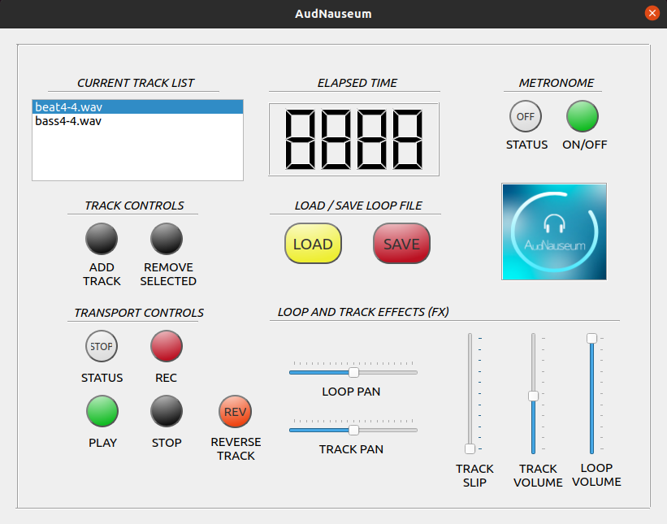
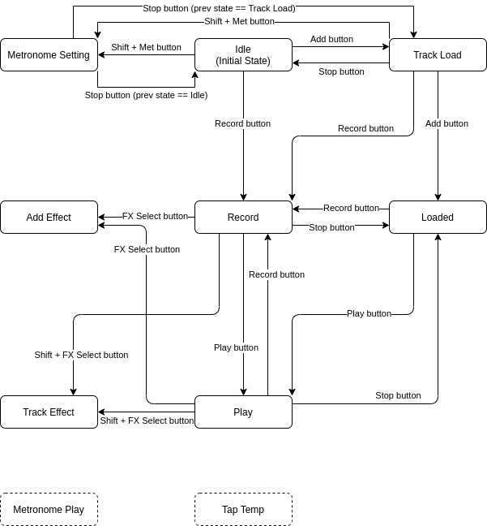
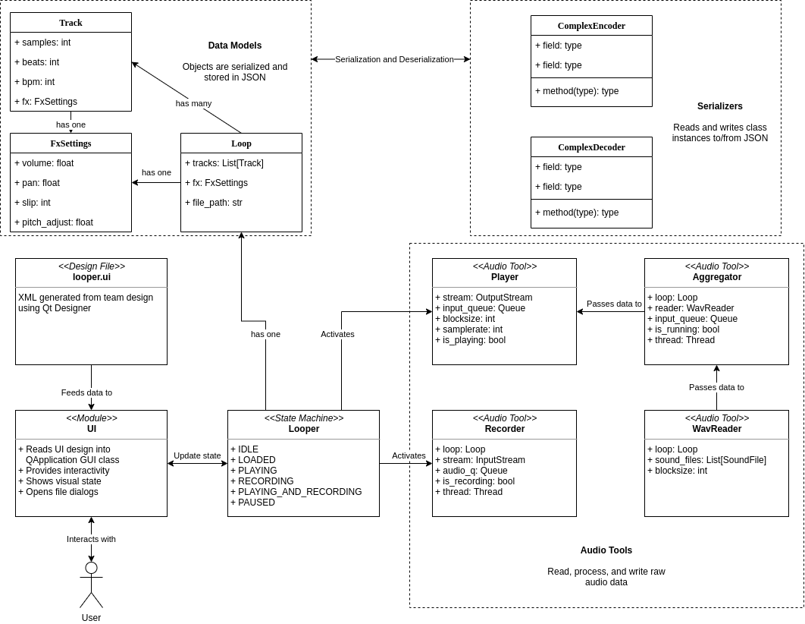

# AudNauseum

AudNauseum is a software emulated loop-based digital recorder/sampler or audio looper for short. Simply put, an audio looper is a device that can record audio into a track while simultaneously playing all recorded tracks, often used by musicians to layer background tracks or to create harmonies with only their own voice and instruments. The audio looper can read and write loops from and to its disk storage, and contains a number of effects that can be used to alter the currently playing or recorded audio.

## Tell Me More...

Upon program startup a default audio loop is loaded with zero tracks and the user is ready to begin recording or add pre-recorded audio files to a repeating loop. For fans of the movie Pitch Perfect 3, [the scene in which the lead actress](https://www.youtube.com/watch?v=yooREhMwzFc) is using a percussion pad (drum beat simulator) while recording audio vocals in DJ Khaled’s hotel room you are seeing an audio looper in action. The same is true here, you can press record and lay down a beat acapella style or sing your favorite tune, press stop and the track is saved.

Click add track and you can navigate to your recorded track and add that to the loop. Press play to hear your beats or vocal track played back. Now is where you can get creative, while playing back the vocals you can press record to record a new beat over top of your previously recorded track. Have a cool sound byte or music track you want to overlay a beat or vocal recording? Import .wav files to the “resources/recordings folder” and you can add those tracks to the looper too!

## How do I run AudNauseum?

Please see the [documentation file](docs/Running_From_Source.md) on running the AudNauseum application from source code.

## Application Design

### State Machine

The core processing model of AudNauseum is a finite state machine.

- Idle: The application has just started
- Load Track: A track will be loaded into the current loop
- Track Loaded: A track has been loaded into the current loop
- Record: A track is currently being recorded through the microphone
- Play: All tracks are currently being played through the speakers
- Add Effect: The user is selecting an effect to add to a track
- Track Effect: An effect is being applied to a track

### Class Diagram

The architecture of AudNauseum generally uses the Object Oriented paradigm.

#### Data Models

The three primary data objects of AudNauseum are:

- `Loop`: Contains many Tracks
- `Track`: An individual audio stream
- `FxSettings`: Represents the cumulative audio effects for either a Track or Loop

For example, a Loop could contain a drumkit Track, a bass Track, and an vocal Track.

#### Encoders / Decoders

- `ComplexEncoder`: Writes a `Loop`/`Track`/`FxSettings` object into a JSON file
- `ComplexDecoder`: Reads a JSON file into a `Loop`/`Track`/`FxSettings` object

#### Core and UI

- Design File: XML file generated by our design in Qt Designer, is loaded to create GUI elements
- UI: "Event listeners" and user input handling logic attached to the GUI elements
- State Machine: Current state of the application. State is updated by user input. State triggers changes to audio input/output.

#### Audio Processing

- `Player`: Processes blocks of raw audio data from the application to the user's output device (speakers)
- `Aggregator`: Combines blocks of raw audio data from multiple Tracks into a single output stream
- `WavReader`: Streams .wav files from disk into blocks of audio data
- `Recorder`: Processes blocks of raw audio data from the user's input device (microphone)

#### Diagram

## Libraries/Tools Used

- [transitions](https://pypi.org/project/transitions/): Manage finite state machine transitions
- [PyQt5](https://pypi.org/project/PyQt5/): Builds the GUI using bindings to the cross-platform GUI framework Qt
- Qt Designer: Visual designer tool for a GUI, produces an XML data file loaded into PyQt5
- [sounddevice](https://python-sounddevice.readthedocs.io/en/0.4.1/): Python bindings to [PortAudio](http://www.portaudio.com/), cross-platform Audio I/O library
- [NumPy](https://numpy.org/): Raw audio data is stored in memory and mutated as NumPy arrays
- [SoundFile](https://pypi.org/project/SoundFile/): Read and write audio data from/to disk
